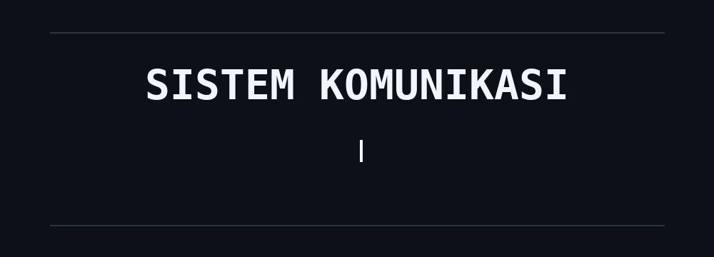

# Hey, We're Siskom👋

### 📡 Communication Systems Workshop
**Telkom University**

> ## Create Innovation for Communication
> *Learn • Build • Innovate • Connect*

---

### 🚀 What We Explore

We bring communication technology to life through hands-on learning,
experimentation, and real-world applications.

| 📊 MATLAB | 🌐 IoT | 🤖 Machine Learning |
|:---:|:---:|:---:|
| Simulation & Analysis | Smart Systems | Intelligent Systems |

---

### 🔬 Our Learning Journey

**01 — MATLAB**  
Explore simulation, signal processing, data analysis, and engineering computation.

**02 — Internet of Things**  
Build connected systems using sensors, devices, and real-time data.

**03 — Machine Learning**  
Discover how data can be transformed into intelligent solutions.

---

### 💡 Beyond the Workshop

> **Think. Create. Connect.**

We believe communication technology is not just about transmitting
information — it's about creating innovative solutions that connect
people, devices, and ideas.

---

### ⚡ Our Focus

`Communication Systems` `MATLAB` `IoT` `Machine Learning`  
`Signal Processing` `Technology Innovation`

---

### 📡 Create Innovation for Communication

**Learn Today. Build Tomorrow. Connect the Future.**
